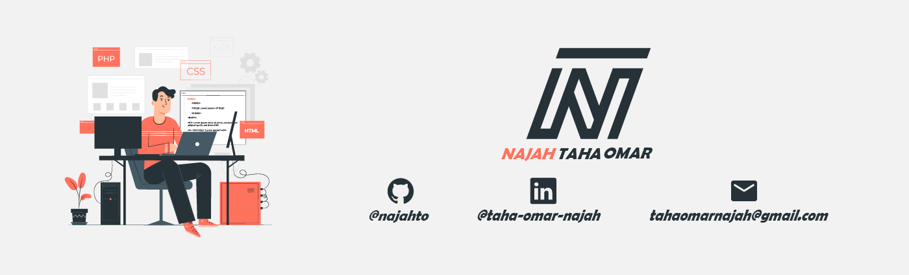

<h1 align="center">Hello I'm NAJAH Taha Omar</h1>

 
 

I'm a multidisciplinary developer and designer(sometimes) with a passion for creating engaging, entertaining user experiences. ✨
I recently graduated from Sultan Moulay Slimane Universit with a Master's degree specialized in Computer System Engineering.

I'm trying to push my skills to the limit. My interests include joining an exciting team of passionate people, personal growth, and making silly faces.

Currently searching for a job opportunity as a junior Full stack web developer. 
        
When I am not coding, I am either playing video games, soccer. Other times I am reading or learning a new language or framework.

## Reach me at:

  
  
  

<!--
**najahto/najahto** is a ✨ _special_ ✨ repository because its `README.md` (this file) appears on your GitHub profile.

Here are some ideas to get you started:

- 🔭 I’m currently working on ...
- 🌱 I’m currently learning ...
- 👯 I’m looking to collaborate on ...
- 🤔 I’m looking for help with ...
- 💬 Ask me about ...
- 📫 How to reach me: ...
- 😄 Pronouns: ...
- ⚡ Fun fact: ...
-->
